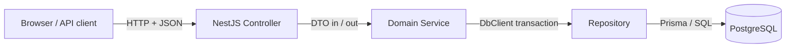
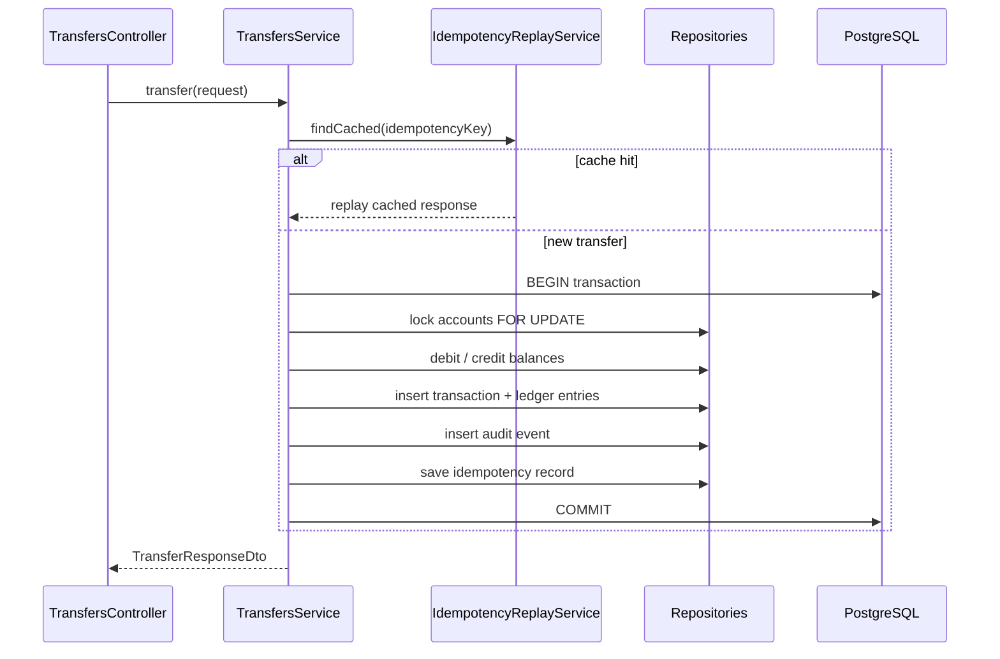

# Architecture

High-level design of the Ledger Banking System backend.

## Request flow



## Layer responsibilities

| Layer | Location | Responsibility |
|-------|----------|----------------|
| **Controller** | `*/\*.controller.ts` | HTTP routing, headers, status codes |
| **DTO** | `*/dto/` | Request validation and response shapes |
| **Mapper** | `*/mappers/` | Convert domain models → API DTOs |
| **Service** | `*/\*.service.ts` | Business rules, transactions, orchestration |
| **Repository** | `repositories/` | Prisma queries, row locking |
| **Model** | `models/` | Domain types, errors, internal result shapes |
| **Common** | `common/` | Cross-cutting utilities shared across features |

## Money movement (transfer)



### Concurrency strategy

1. Single `prisma.$transaction` per transfer
2. Lock accounts with `SELECT … FOR UPDATE` in **UUID order** (deadlock prevention)
3. Check balance under lock before debit
4. Retry up to 3 times on PostgreSQL deadlock (`40P01`)

## Reversal

Reversals use a **compensating transaction** — history is never deleted.

1. Lock original transaction row
2. Verify status is `completed` and not already reversed
3. Lock accounts, debit destination, credit source
4. Create `reversal` transaction + opposite ledger entries
5. Mark original as `reversed`

## Audit logging

| When | Where it commits |
|------|------------------|
| Success (transfer, reverse, create account) | Same DB transaction as the business write |
| Failure (validation, insufficient funds) | Separate transaction via `AuditWriterService` |

Failure audits survive rollbacks of the main transaction.

## Idempotency

| Concern | Implementation |
|---------|----------------|
| Client header | `Idempotency-Key` (required on transfer + reverse) |
| Cache lookup | `IdempotencyReplayService` |
| Persistence | `idempotency_keys` table |
| Race on unique constraint | `resolveIdempotencyRace()` returns cached result |

## API response pattern

All endpoints return **DTOs**, not raw Prisma records:

| Endpoint | Response DTO |
|----------|--------------|
| `GET /accounts` | `AccountsListResponseDto` |
| `POST /accounts` | `AccountResponseDto` |
| `POST /transfers` | `TransferResponseDto` |
| `GET /transactions` | `TransactionListResponseDto` |
| `POST /transactions/:id/reverse` | `ReverseResponseDto` |

Internal services use domain types (`TransferResult`, `MoneyMovement`) and mappers convert to DTOs at the boundary.

## Directory map

```
src/
├── accounts/           # Account CRUD
├── transfers/          # Transfer endpoint
├── transactions/       # History + reversal
├── repositories/       # Data access
├── models/             # Domain types
├── common/
│   ├── services/       # AuditWriter, IdempotencyReplay
│   ├── utils/          # Prisma error helpers, HTTP idempotency
│   ├── decorators/     # RequestId, IdempotencyKey
│   └── filters/        # DomainExceptionFilter
├── prisma/             # Prisma client module
└── lib/                # money.ts utilities
```

## Error handling

Domain errors (`models/errors.ts`) carry `code` + `httpStatus`. The global `DomainExceptionFilter` maps them to:

```json
{
  "error": {
    "code": "INSUFFICIENT_FUNDS",
    "message": "Source account balance 10.00 is less than transfer amount 50.00"
  }
}
```
